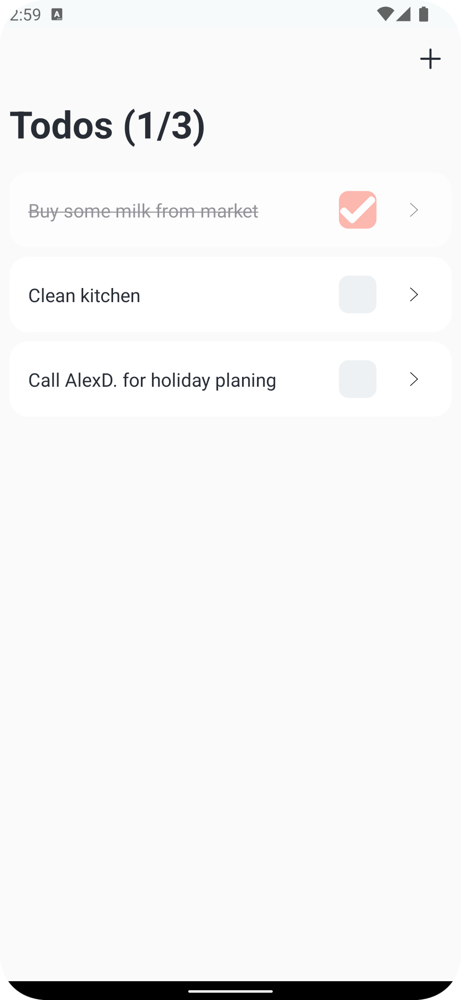
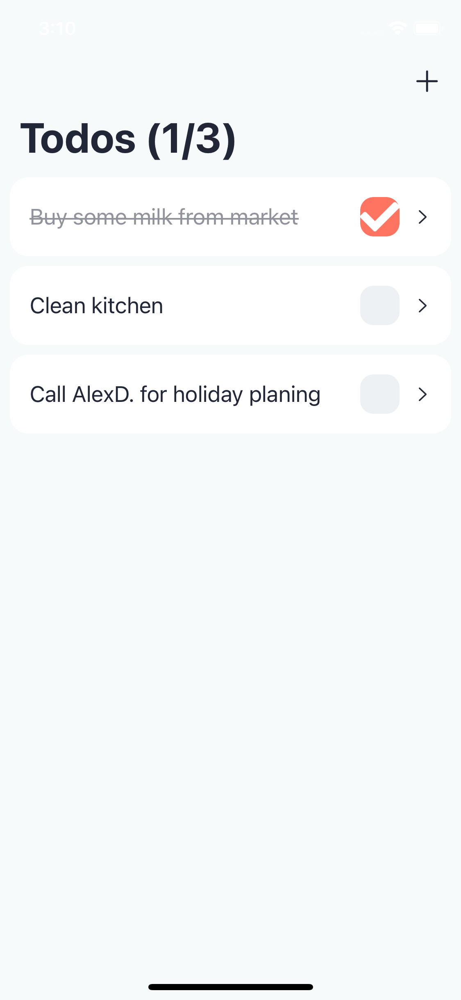
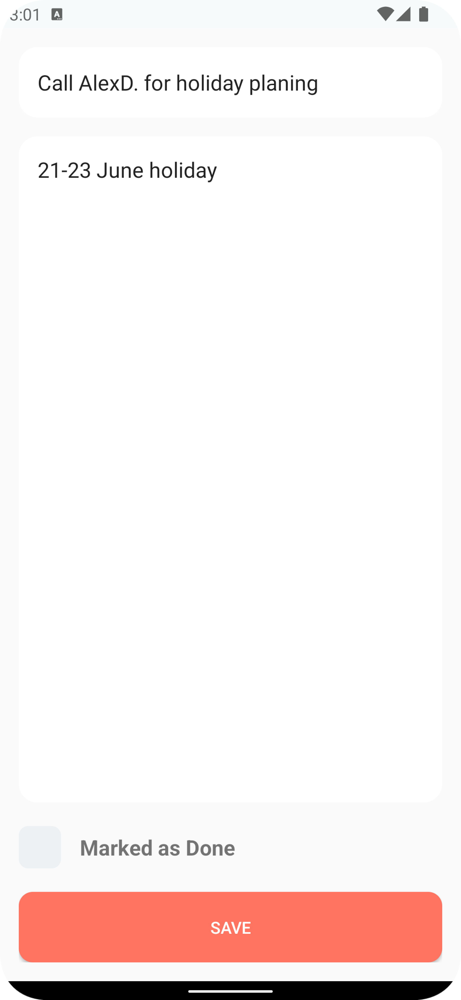
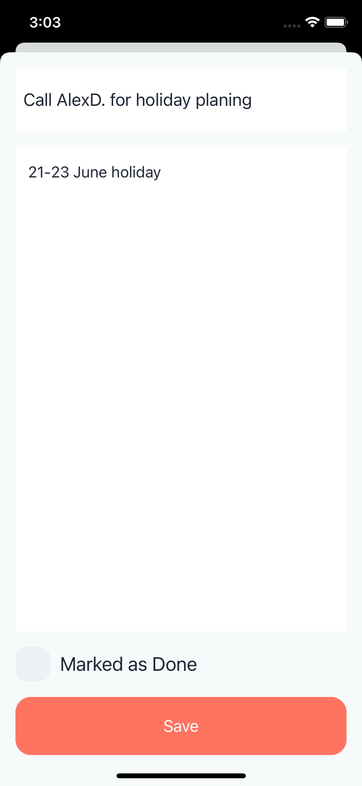
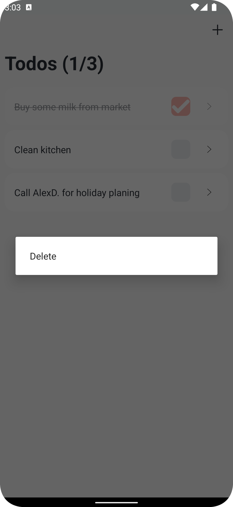
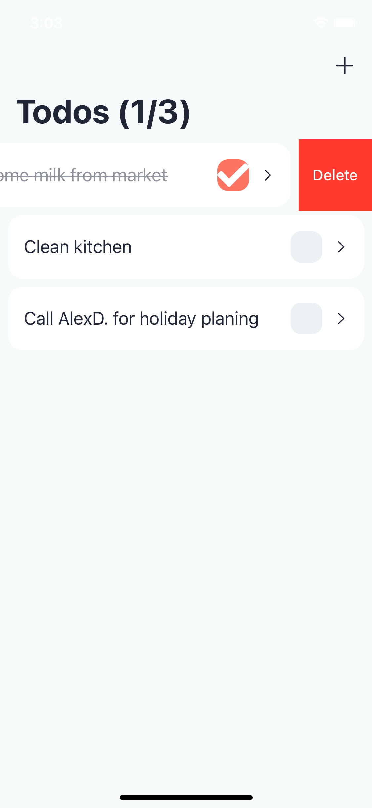

# Kotlin Multiplatform Mobile (KMM) Example Project (Todo)

This is basic **Todo Application** which is developed with **KMM** SDK and applied **MVVM**  with **Clean Architecture**. 

## Includes
- Android Application,
	- Activity & Fragments
	- View Models
	- Views
- iOS Application,
	- Storyboards, Views
	- View Controllers
	- View Models
- Shared Code Module
	- Repositories
	- Usecases
	- Mappers

## Used Techs
- **KMM** to share common code module,
- **SQLDelight** for persist data
- **Koin** for dependency injection
- **Kotlin** for Native Android View & Shared Module development
- **Swift** for Native IOS View development
- **Coroutines** for async operations

## Screenshots

<table style="padding:5px">
	<tr>
		<td align="center">
			<h1>Android</h1>
		</td>
		<td align="center">
			<h1>IOS</h1>
		</td>
  	</tr>
	<tr>
    <td align="center">
			
    	</td>
		<td align="center">
			
    	</td>
  	</tr>
  	<tr>
    <td align="center">
			
    	</td>
		<td align="center">
			
    	</td>
  	</tr>
  	<tr>
    <td align="center">
			
    	</td>
		<td align="center">
			
    	</td>
  	</tr>
</table>

